#Fundamentos de la electrónica

##Introducción
Antes que nada, quisiera compartir con ustedes cierta frase que me ha estado acompañando desde hace ya bastante tiempo:  
>"Me lo contaron y lo olvidé, lo vi y lo aprendí, lo hice y lo entendí."

Dicho esto, bienvenidos a esta sección del entrenamiento, en la que nos enfocaremos en la electrónica. Así que daremos un vistazo realmente rápido a la evolución que ha tenido esta rama.

 

----------

***Érase una vez***

Ya desde los años **1800** con la invención de la **pila voltaica** (cortesía de Alessandro Volta), empezaron los avances en este campo. Otros grandes avances, hoy obsoletos y ligeramente olvidados, fueron el diodo al vacío (**1904, Fleming**), el primer dispositivo rectificador de corriente; y el triodo (**1906, Lee**), el primer componente amplificador electrónico. Sin embargo, todo dio un salto enorme desde la invención del **transistor**, en **1947**. Esto redujo enormemente el espacio y los recursos necesarios para implementar un circuito.

El desarrollo de los semiconductores pronto permitiría que en un solo chip puedan entrar 6 transistores dando nacimiento al primer **circuito integrado**, en **1958**. Luego, en **1970** se desarrolló el primer **microprocesador**. Años después, la eletrónica ha dejado (en gran parte) de ser una ciencia solo para aplicaciones industriales, para convertirse en parte de lo cotidiano. Poseemos celulares, radios, computadoras y un sinfín de equipos que consideramos parte de nuestras vidas. 

Si bien la intención de este entrenamiento no es desarrollar cosas con tal magnitud de complejidad, deseamos que obtengan las herramientas básicas para prototipar circuitos, pierdan el miedo a lo desconocido y puedan realizar los proyectos que necesiten, desde el ámbito universitario hasta la domótica.

---

***Empecemos entonces***

Si no tienes ni idea de qué es un miliamperio, y deseas averiguarlo, te recomiendo que leas un poco de la teoría **[aquí](https://github.com/eyallico/Content/blob/master/Semana1/Electronica/Teoria.md)** 

Si quieres pasar directo a la acción (aunque un repaso nunca está de más) sigue leyendo. Empezaremos con una breve introducción a las herramientas que utilizaremos:

Arduino es una plataforma de hardware y software de fácil manejo. A lo largo del entrenamiento trabajaremos con el Arduino UNO, cuyas características más relevantes para nuestro caso son:

- 13 salidas/entradas configurables
- 6 entradas analógicas.

Si quieres saber la diferencia entre digital y analógico, revisa **[por acá](https://github.com/eyallico/Content/blob/master/Semana1/Electronica/DigitalVsAnalogico.md )**.

La otra herramienta que utilizaremos será el [123D Circuits](http://123d.circuits.io/). Este es un simulador de circuitos electrónicos, que nos permitirá, mediante un protoboard virtual, realizar varios proyectos, también implementables en la vida real.

##Ejemplos

***Y por fin algo de acción***

Como ya hemos mencionado, el Arduino puede leer datos de dos maneras, digital y analógica. Empezaremos con lo digital. ¿Cuál es la manera correcta de darle un 1 o un 0? Si pensaste en botones y switchs, tienes el 50% de la respuesta correcta. El otro 50% radica en la forma de conectarlos. Tenemos entonces 2 formas (efectivamente, ponerle un cable directo también funciona, pero significaría tener que mover cables para cambiar el valor, y es riesgoso):

Tenemos entonces 2 configuraciones para los pulsadores: **pull-up** y **pull-down**

>Consideraciones: En los siguientes ejemplos emplearemos una especie de "pantallita" conocida técnicamente como **multímetro**. Esta nos permite observar valores como la corriente, el voltaje, y la resistencia. Cuando empecemos a usar el Arduino, la usaremos con menos frecuencia. Por el momento usamos el Arduino solo como una fuente de voltaje, no tiene nada programado.

Pull-up entrega constantemente al pin un "0" lógico, y cuando se presiona el pulsador, entrega un "1". Las conexiones son como se muestran:

Pull-down entrega constantemente al pin un "1" lógico, y al presionar el pulsador, entrega un "0". Las conexiones son las siguientes:

Y, ¿cómo entregamos un valor analógico? La respuesta está en el siguiente diagrama de conexión: se emplea un potenciómetro.

Es hora de poner manos a la obra. 

##Ejercicios

Primero lo primero.
Para poder usar el 123D Circuits a plenitud, necesitamos una cuenta, así que a registrarnos. Ingresar a <http://123d.circuits.io/>  y crear una cuenta.

Al logearnos, en la esquina superior derecha podemos observar la ubicación de nuestros proyectos. CLick en el sujeto gris.

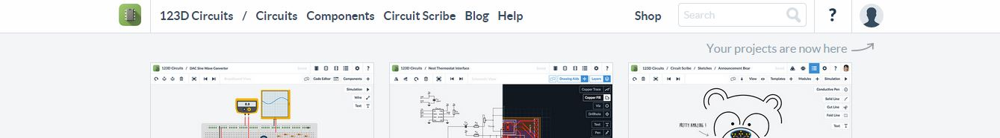

Esta es mi cuenta, hasta el momento. Pueden observarse los proyectos que tengo disponibles, y un par de opciones a la derecha de los proyectos

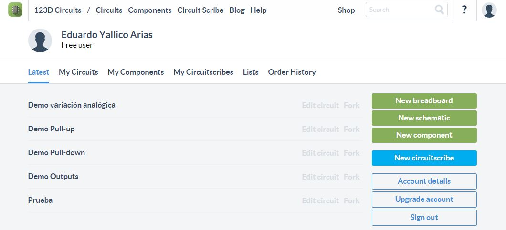

Click en **New breadbord**, o nuevo protoboard.

Daremos una mini explicación del entorno:

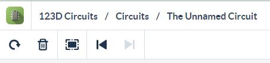

Aquí tenemos el nombre del circuito que estamos diseñando. El nombre por default es **"The Unnamed Circuit"**. Luego, debajo, de izquierda a derecha, tenemos los botones **Rotate**, que se gira componentes en el protoboard; **Delete**, cuya función es eliminar componentes; **zoom to fit**, que ajusta el zoom para que podamos ver todos los objetos puestos en el área de trabajo; y por último tenemos las opciónes **Undo** y su contraparte, para deshacer cambios recientes.

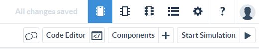

Del otro lado, arriba, tenemos botontes bastante peculiares. Al lado de "All changes saved" podemos observar 3 botones que parecen pequeños chips. Estos son las vistas disponibles. Tenemos la **vista en protoboard**, la **vista del esquemático** y la **vista en el PCB**. Usaremos para el entrenamiento la vista en protoboard (breadboard). El siguiente botón corresponde a la **cuenta por materiales**, que nos entrega un precio promedio de los componentes requeridos. Finalmente tenemos la **vista de configuraciones**, donde podemos cambiar el nombre de nuestro proyecto. Finalmente, podemos ver los botones de **feedback** y nuestro **usuario**.

Debajo tenemos los botones de **chat**; el **editor de código**, donde pondremos el código para Arduino; la **librería de componentes**, que podremos colocar en el protoboard; y el más importante, **Iniciar simulación**, que nos permite probar nuestro circuito.

Luego tenemos el área de trabajo, que tiene un protoboard.

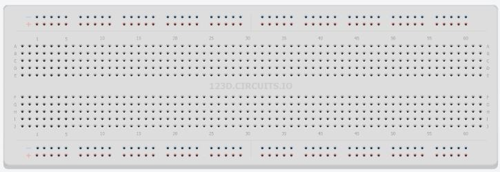

¿Cómo funciona el protoboard? 
Tiene conexiones internas que facilitan el cableado. Estas están dispuestas de la siguiente manera:

Los extremos tienen conexión horizontal interna. Cualquier cosa que se conecte a alguno de los pines en esa línea, también estará conectada a otra en la misma línea.

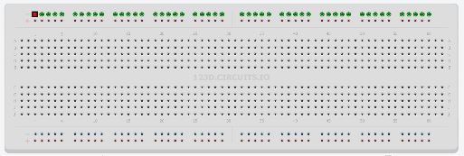

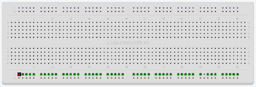

La parte interna tiene conexiones verticales, pero la línea central funciona división, es decir, las dos zonas centrales están aisladas entre sí.

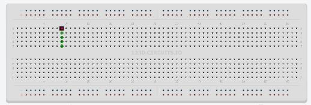

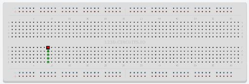

Ahora que sabes esto, es tu turno.

Arma la configuración analógica (con el potenciómetro, la 3ra mostrada) en 123D Circuits y conecta un cable desde la misma columna que va al Voltímetro, a la entrada A1 del Arduino, y cópiale el siguiente programa al editor de código:

> int dato = 0;  
>void setup()  
{  
>}  
>void loop()   
{  
>dato = analogRead(A1);    
>Serial.println(dato);   
>delay(500);  
>}

Próximamente explicaremos como programar en Arduino, este es un mero programa de prueba.

Una vez pegado, de click en *Start Simulation* y sin cerrar el editor de código, dé click en el monitor serial (en la parte derecha del editor de código), como se ve en la imagen, para poder observar los valores de la lectura analógica. Mueva el valor con el potenciómetro para ver la variación. 

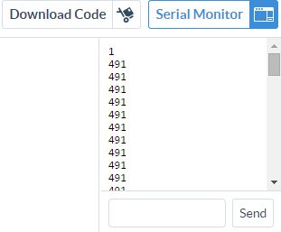

y felicidades.

Aquí hay una muestra de cómo debe de quedar el circuito.

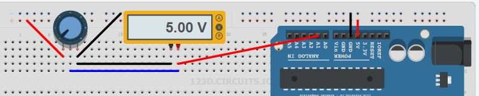

Ahora realice el mismo procedimiento (empleando el mismo código también) para las configuraciones Pull-up y Pull-down.

#Cuestionario

1-  ¿Cuál es la unidad para medir **corriente**?
- Voltios
- Amperios
- Ohmios

2-  La configuración Pull-up entrega un ... al presionar el pulsador.
- "o"
- "1"

3-  La configuración analógica emplea para funcionar un...
- Potenciómetro
- LDR
- Led

4- El protoboard posee en total ... zonas aisladas.
- 3
- 4
- 5

5-  El 123D Circuits permite probar códigos en Arduino
- V
- F

