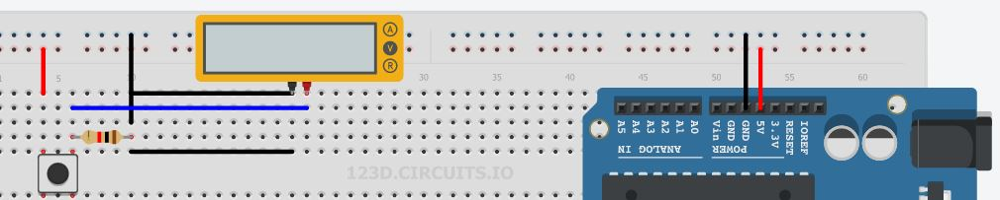
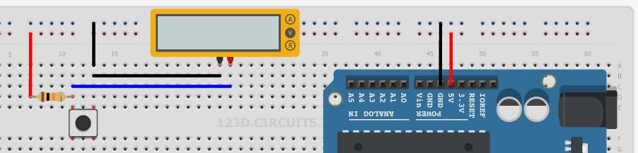
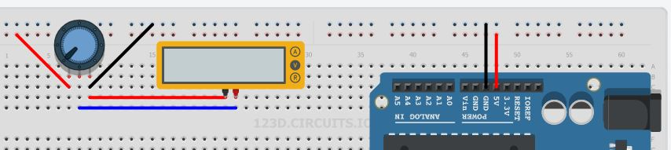

#Fundamentos de la electrónica
Antes que nada, quisiera compartir con ustedes cierta frase que me ha estado acompañando desde hace ya bastante tiempo:  
>"Me lo contaron y lo olvidé, lo vi y lo aprendí, lo hice y lo entendí."

Dicho esto, bienvenidos a esta sección del entrenamiento, en la que nos enfocaremos en la electrónica. Así que daremos un vistazo realmente rápido a la evolución que ha tenido esta rama.

 

----------

***Érase una vez***

Ya desde los años **1800** con la invención de la **pila voltaica** (cortesía de Alessandro Volta), empezaron los avances en este campo. Otros grandes avances, hoy obsoletos y ligeramente olvidados, fueron el diodo al vacío (**1904, Fleming**), el primer dispositivo rectificador de corriente; y el triodo (**1906, Lee**), el primer componente amplificador electrónico. Sin embargo, todo dio un salto enorme desde la invención del **transistor**, en **1947**. Esto redujo enormemente el espacio y los recursos necesarios para implementar un circuito.

El desarrollo de los semiconductores pronto permitiría que en un solo chip puedan entrar 6 transistores dando nacimiento al primer **circuito integrado**, en **1958**. Luego, en **1970** se desarrolló el primer **microprocesador**. Años después, la eletrónica ha dejado (en gran parte) de ser una ciencia solo para aplicaciones industriales, para convertirse en parte de lo cotidiano. Poseemos celulares, radios, computadoras y un sinfín de equipos que consideramos parte de nuestras vidas. 

Si bien la intención de este entrenamiento no es desarrollar cosas con tal magnitud de complejidad, deseamos que obtengan las herramientas básicas para prototipar circuitos, pierdan el miedo a lo desconocido y puedan realizar los proyectos que necesiten, desde el ámbito universitario hasta la domótica.

---

***Empecemos entonces***

Si no tienes ni idea de qué es un miliamperio, y deseas averiguarlo, te recomiendo que leas un poco de la teoría **[aquí](https://github.com/eyallico/Arduino/blob/master/Teoria.md
)** 

Si quieres pasar directo a la acción (aunque un repaso nunca está de más) sigue leyendo. Empezaremos con una breve introducción a las herramientas que utilizaremos:

Arduino es una plataforma de hardware y software de fácil manejo. A lo largo del entrenamiento trabajaremos con el Arduino UNO, cuyas características más relevantes para nuestro caso son:

- 13 salidas/entradas configurables
- 6 entradas analógicas.

Si quieres saber la diferencia entre digital y analógico, revisa **[por acá](https://github.com/eyallico/Arduino/blob/master/DigitalVsAnalogico.md
)**.

La otra herramienta que utilizaremos será el [123D Circuits](http://123d.circuits.io/). Este es un simulador de circuitos electrónicos, que nos permitirá, mediante un protoboard virtual, realizar varios proyectos, también implementables en la vida real.

***Y por fin algo de acción***

Como ya hemos mencionado, el Arduino puede leer datos de dos maneras, digital y analógica. Empezaremos con lo digital. ¿Cuál es la manera correcta de darle un 1 o un 0? Si pensaste en botones y switchs, tienes el 50% de la respuesta correcta. El otro 50% radica en la forma de conectarlos. Tenemos entonces 2 formas (efectivamente, ponerle un cable directo también funciona, pero significaría tener que mover cables para cambiar el valor, y es riesgoso):

Tenemos entonces 2 configuraciones para los pulsadores: **pull-up** y **pull-down**

>Consideraciones: En los siguientes ejemplos emplearemos una especie de "pantallita" conocida técnicamente como **multímetro**. Esta nos permite observar valores como la corriente, el voltaje, y la resistencia. Cuando empecemos a usar el Arduino, la usaremos con menos frecuencia. Por el momento usamos el Arduino solo como una fuente de voltaje, no tiene nada programado.

Pull-up entrega constantemente al pin un "0" lógico, y cuando se presiona el pulsador, entrega un "1". Las conexiones son como se muestran:

Pull-down entrega constantemente al pin un "1" lógico, y al presionar el pulsador, entrega un "0". Las conexiones son las siguientes:

Y, ¿cómo entregamos un valor analógico? La respuesta está en el siguiente diagrama de conexión: se emplea un potenciómetro.

Los animo a que repliquen los esquemas mostrados anteriormente y los prueben por sí mismos. Y aprovechen al máximo el 123D Circuits. 

