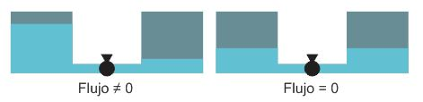
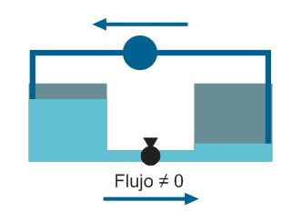
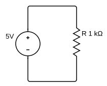
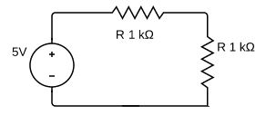
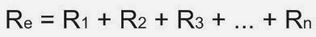
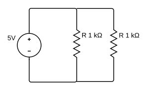
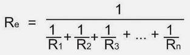

##Conceptos básicos

Primero daremos una breve explicación de la teoría básica necesaria.   

El voltaje, o diferencia de potencial, puede ser asimilado como la diferencia de nivel entre dos tanques conectados.

Si no hay diferencia de nivel, no puede haber flujo. Lo mismo ocurre con la corriente. Si no hay diferencia de potencial, no hay corriente. Sin embargo, hay otro requisito, y es que el flujo sea permitido por las conexiones entre los tanques. Es decir, mientras nadie le permita el paso, a pesar de tener voltaje, la corriente será 0.

Ahora bien, contamos con una diferencia de potencial estable. Para que esto ocurra, usamos una fuente de voltaje, que puede ser asemejada a una bomba de agua que mantiene la diferencia de nivel, permitiendo un flujo constante por diferencia de potencial.

Sin embargo, la cantidad de agua que circula depende de la tubería. Mientras más angosta sea, menos agua podrá circular. Esto se asemeja a las resistencias, que limitan el flujo de la corriente.

Es hora de ponerle unidades. La **diferencia de potencial** (diferencia de nivel) se mide en **voltios (V)**; la **intensidad de corriente** (flujo de agua), en **amperios (A)** y la **resistencia** (el ancho de la tubería), en **ohmios (Ω)**.   
La relación entre las variables anteriormente mencionadas es descrita por la famosa ley de Ohm:

> Voltaje = Corriente x Resistencia

>V = I X R

Puesto que un amperio es una unidad bastante grande de corriente, lo normal es trabajar con el **miliamperio (mA)**

Realizaremos el cálculo correspondiente para el siguiente circuito:

Puesto que tenemos como datos el voltaje (5V) y la resistencia (1 KΩ), calcularemos la corriente, mediante la ley de ohm. Así de simple, obtenemos la respuesta: **5 mA** (o también 0.005 A, aplicar conversion de unidades, 1A = 1000 mA).

Siguiente concepto importante, la resistencia equivalente. Se sigue aplicando la ley de Ohm, pero con una consideración, en este caso: 

> La resistencia equivalente de "n" resistencias en serie es igual a la suma de dichas resistencias

Entonces ambas resistencias pueden ser reemplazadas por su equivalente, es decir, una resistencia de 2KΩ. Realizando nuevamente los cálculos, obtenemos el nuevo valor de la corriente: 2.5 mA 

> La resistencia equivalente de "n" resistencias en paralelo es igual a la inversa de la suma de sus inversas"

Entonces ambas resistencias pueden ser reemplazadas por su equivalente, es decir, una resistencia de 500Ω. Realizando nuevamente los cálculos, obtenemos el nuevo valor de la corriente: 10 mA.

Notamos aquí algo curioso, en ambos casos tuvimos la misma cantidad de resistencias, y estas fueron del mismo valor. La unica diferencia fue la manera de conectarlas.

